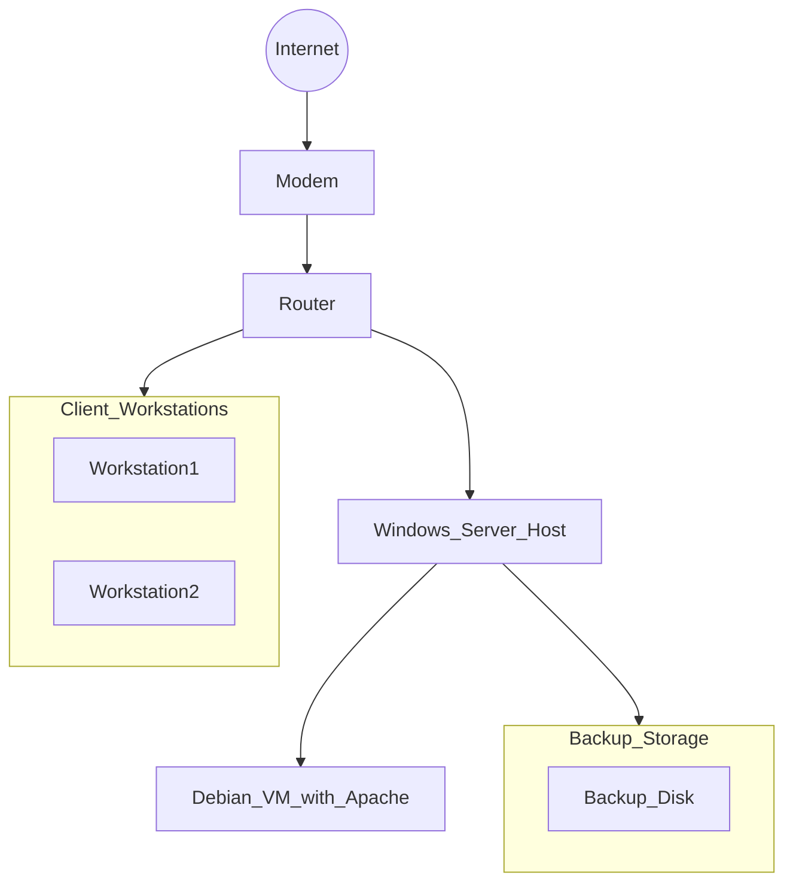

# Network Diagram for IMI Shitpoststatus

   

### Explanation:

- **Windows Server (Desktop Computer):** Acts as the primary server hosting the virtualized environment. It runs Windows Server and provides the physical hardware for hosting the virtual machines.

- **Virtualization (Windows Hyper-V):** Utilizes virtualization technology (e.g., Windows Hyper-V) to create and manage virtual machines. In this case, it hosts an Debian virtual machine where the IMISHITPOSTSTATUS website is deployed.

- **Debian VM (IMISHITPOSTSTATUS Website):** Runs the IMISHITPOSTSTATUS website within an Debian virtual machine environment. It serves as the primary server software for hosting the website and handles user requests and data processing.

- **Backup Storage (External Hard Drive, Cloud, etc.):** Provides storage for backup data and configurations. This could include external hard drives, cloud storage services, or other backup solutions used to store backups of critical data from the Windows Server host machine and the Debian VM.
